# 🧠 RAG Cortex

A powerful Retrieval-Augmented Generation (RAG) chatbot that lets you chat with your PDF documents. Built with **Streamlit**, **LangChain**, **Groq**, and **ChromaDB**.

## ✨ Features
- **Chat with PDFs** — Ask questions and get accurate answers based on your documents
- **Dark Notion-style UI** — Clean, minimal dark theme interface
- **Document Management** — Add and delete documents from the sidebar
- **Duplicate Detection** — Warns before re-uploading files already indexed
- **Semantic Chunking** — Splits by topic, not arbitrary character counts
- **Text Preprocessing** — Removes citations, page numbers, and bibliography noise
- **Cross-Encoder Reranking** — Filters irrelevant results using semantic relevance scoring
- **Persistent Memory** — ChromaDB saves embeddings to disk (load in seconds)
- **High-Performance LLM** — Groq API running Llama 3.3 70B
- **Local Embeddings** — Ollama `nomic-embed-text` for private processing

## 🛠️ Tech Stack
| Component | Tool | Why? |
|-----------|------|------|
| **Frontend** | Streamlit | Fast, interactive UI in pure Python |
| **Framework** | LangChain | Orchestrates the RAG pipeline |
| **LLM** | Groq API | Extremely fast inference for Llama 3 |
| **Embeddings** | Ollama | Runs `nomic-embed-text` locally |
| **Vector Store** | ChromaDB | Persists to disk (unlike RAM-only FAISS) |
| **PDF Parser** | PyMuPDF | Better text extraction than PyPDF |
| **Reranker** | Cross-Encoder | Filters irrelevant results with semantic scoring |

## 📁 Project Structure
```
RAG-Chatbot/
├── src/
│   ├── app.py          # Streamlit UI
│   ├── rag_core.py     # RAG logic
│   └── styles.css      # Dark theme CSS
├── documents/          # Your PDFs go here
├── rag_vector_store/   # ChromaDB persistence
└── .env                # API keys
```

## ⚙️ Setup

1. **Prerequisites**:
   - Python 3.13+
   - [Ollama](https://ollama.com/) installed
   - Pull the embedding model: `ollama pull nomic-embed-text`

2. **Install Dependencies**:
   ```bash
   pip install -r requirements.txt
   ```

3. **Environment Variables**:
   Create a `.env` file in the root directory:
   ```env
   GROQ_API_KEY=your_groq_api_key_here
   ```

4. **Run the App**:
   ```bash
   cd src
   streamlit run app.py
   ```

## 🧠 How It Works
1. **Ingestion** — Scans `documents/` folder for PDFs (PyMuPDF)
2. **Cleaning** — Removes citations, page numbers, bibliography entries
3. **Chunking** — Semantic splitting by topic shifts, with size limits
4. **Embedding** — Converts text to vectors via `nomic-embed-text`
5. **Storage** — Saves vectors to `rag_vector_store/` (ChromaDB)
6. **Retrieval** — Fetches top 20 similar chunks for your question
7. **Reranking** — Cross-Encoder scores relevance, filters to top 3
8. **Generation** — Sends question + context to Groq (Llama 3.3)

## 💡 Lessons Learned

### Vector Store: FAISS vs Chroma
- **FAISS**: Stores in RAM, requires re-processing on restart
- **Chroma**: Persists to disk, instant 2-second reload ✓

### Embeddings: Speed vs Accuracy
- **HuggingFace** (`all-MiniLM-L6-v2`): Fast but lower accuracy
- **Ollama** (`nomic-embed-text`): Best balance, 8192 token context ✓
- **FastEmbed** (`BAAI/bge-small`): Future option for 1000+ docs

### Chunking: Character vs Semantic
| Method | How it works | Pros | Cons |
|--------|--------------|------|------|
| **Character** | Cut every N chars | Simple, fast | Breaks mid-sentence |
| **Semantic** | Split by topic shifts | Coherent chunks | Variable sizes |
| **Recursive Semantic** | Semantic + size limits | Best of both ✓ | More complex |
| **Small-to-Big** | Search small chunks, return parent context | Very precise search + full context | Complex metadata linking |


### PDF Parsing: PyPDF vs PyMuPDF
- **PyPDF**: Simple but breaks text with unusual fonts (`"Ar e W e"`)
- **PyMuPDF**: Handles styled text, fonts, and formatting better ✓

### Text Preprocessing Trade-offs
Regex cleaning removes citations and page numbers but may catch valid content like "Table 1". The **reranker** post-retrieval filters irrelevant results more intelligently using semantic understanding.

### Reranking: Why Cross-Encoder?

| Reranker | Latency (20 docs) | MRR@10* | Cost | Complexity |
|----------|-------------------|---------|------|------------|
| **Cross-Encoder** | ~150ms | 0.39 | Free (local) | Low ✓ |
| **ColBERT** | ~50ms | 0.36 | Free (local) | High (GPU) |
| **LLM-as-Reranker** | ~2s | 0.40+ | API costs | Low |
| **Cohere API** | ~100ms | 0.40 | Per-request | Very Low |

*MRR@10 = Mean Reciprocal Rank on MS MARCO passage reranking benchmark

**Why Cross-Encoder:** Best local accuracy (MRR 0.39), runs locally with no API costs, simple integration with `sentence-transformers`, and works well for small candidate sets (k ≤ 25).

### Reranker Implementation: `.rank()` vs `.predict()`
| Method | Pros | Cons |
|--------|------|------|
| `.predict()` | Full control | Manual sorting required |
| `.rank()` | Built-in sorting, cleaner API ✓ | Less flexible |

Using `Sigmoid()` activation converts raw logits to 0-1 probability scores for interpretability.

### Rejected Idea: Passing Relevance Scores to LLM
**Idea:** Include relevance scores with context so LLM can weight sources differently.

**Why rejected:**
- LLMs don't reason well about numerical scores
- Document ordering already conveys importance
- Risk of LLM ignoring correct content due to low score
- Adds prompt complexity without clear benefit

### Known Limitations: Styled Text Extraction
PyMuPDF sometimes fails to extract styled text (bold, italic, hyperlinks, colored text).

**Examples encountered:**
- `"Cyberpunk"` (blue hyperlink) → extracted as blank
- `"MMLU"` (bold italic) → not captured

**Workaround:** The reranker's `min_score=0.3` threshold filters out irrelevant results.

**Future solution:** Multimodal RAG using vision models to "see" PDFs as images.

---

## 🏗️ Architecture

```mermaid
flowchart TB
    subgraph INGESTION ["📥 Document Ingestion"]
        A[("📄 Raw PDFs")] --> B["PyMuPDF Loader"]
        B --> C["Text Extraction"]
        C --> D["clean_document_text()"]
        D --> E["Remove citations, page numbers, bibliography"]
    end

    subgraph CHUNKING ["✂️ Semantic Chunking"]
        E --> F["SemanticChunker"]
        F --> G["Split by topic shifts"]
        G --> H["RecursiveCharacterTextSplitter"]
        H --> I["Enforce max size (1500 chars)"]
        I --> J["Merge tiny chunks (<200 chars)"]
    end

    subgraph EMBEDDING ["🔢 Embedding & Storage"]
        J --> K["Ollama nomic-embed-text"]
        K --> L["Generate 768-dim vectors"]
        L --> M[("ChromaDB")]
    end

    subgraph RETRIEVAL ["🔍 Query Pipeline"]
        N["❓ User Question"] --> O["Embed Question"]
        O --> P["Vector Similarity Search (k=20)"]
        M --> P
        P --> Q["Top 20 Candidates"]
    end

    subgraph RERANKING ["🎯 Cross-Encoder Reranking"]
        Q --> R["ms-marco-MiniLM-L-6-v2"]
        R --> S["Score each (query, doc) pair"]
        S --> T["Filter min_score ≥ 0.3"]
        T --> U["Return Top 3"]
    end

    subgraph GENERATION ["💬 Response Generation"]
        U --> V["Build Context"]
        N --> W["Groq API (Llama 3.3 70B)"]
        V --> W
        W --> X["🎯 Final Answer"]
    end

    style INGESTION fill:#1a1a2e,stroke:#16213e
    style CHUNKING fill:#1a1a2e,stroke:#16213e
    style EMBEDDING fill:#1a1a2e,stroke:#16213e
    style RETRIEVAL fill:#0f3460,stroke:#16213e
    style RERANKING fill:#533483,stroke:#16213e
    style GENERATION fill:#e94560,stroke:#16213e
```


